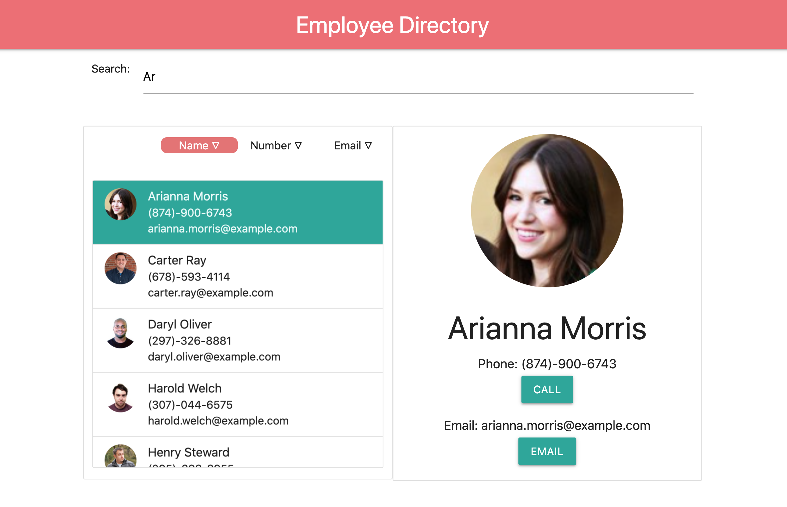

# Employee Directory
  [](https://opensource.org/licenses/MIT)

  

  ## Deployed Application

  https://kevinconnell96.github.io/employeeDirectory/

  ## Description

  This application is a interactive contact directory! The user is able to filter through the contact list with a search feild, and sort results by ascending or descending alphanumeric order. This application, although simple in design, is power by React components and dynamically changes at the users will!

  ## Table of Contents

  * [Installation](#installation)

  * [Usage](#usage) 
  
  * [License](#license)

  * [Contributing](#contributing)

  * [Tests](#tests)

  * [Questions](#questions)
  
  ## Installation

  To run, install using the following command:
  ```
  none
  ```

  ## Usage

  For use: Follow the deployed link
  
  ## License

  This application is protected under a MIT license

  ## Contributing

  Feel free to contact me with inquiries to contribute!

  ## Tests

  To run tests, run the following command:
  ```
  none
  ```

  ## Questions?

  If you have any questions or issues please contact me via email at kevin.t.connell@gmail.com. You can find more examples of my work at [kevinconnell96](https://github.com/kevinconnell96)
